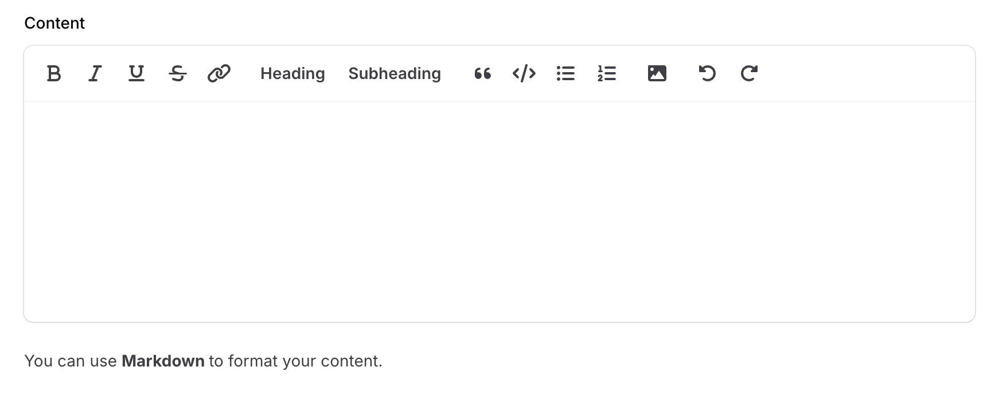
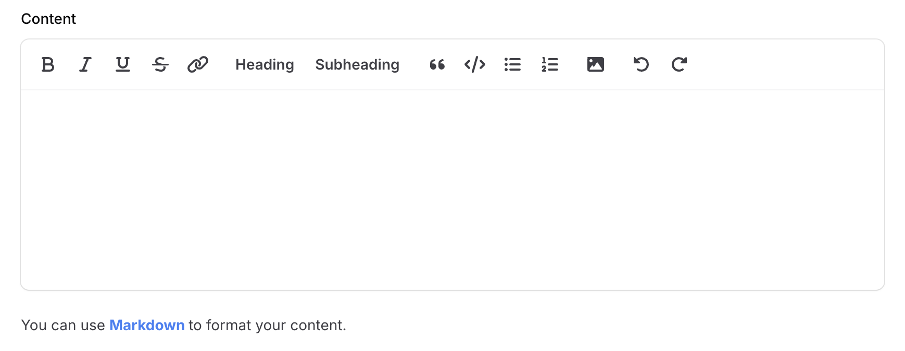
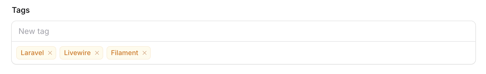
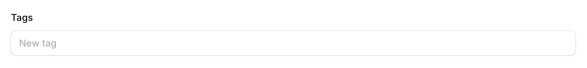
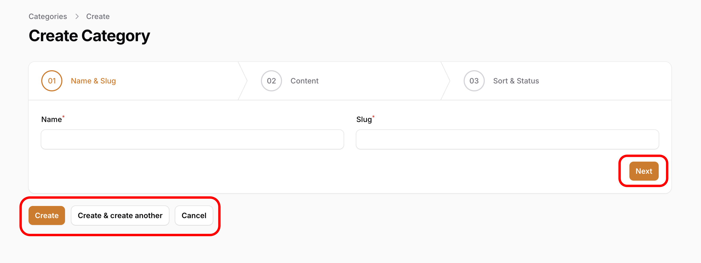

# FormBuilder: Common Errors to Avoid

## Introduction
As a member of the Filament community, I frequently respond to questions and issues raised in [Filament Discord](https://filamentphp.com/discord) and [Filament GitHub discussions](https://github.com/filamentphp/filament/discussions). 
Many of these involve common mistakes developers make while building forms in Filament. 
In this article, I'll highlight some of these errors and show you how to avoid them.

## Error 1: Using New Tailwind Classes Without Defining a Theme

Suppose you want to add a custom Tailwind class to the [helperText](https://filamentphp.com/docs/3.x/forms/fields/getting-started#adding-helper-text-below-the-field) of a [RichEditor](https://filamentphp.com/docs/3.x/forms/fields/rich-editor) component:

```php
RichEditor::make('content')
    ->columnSpanFull()
    ->helperText(new HtmlString(<<<'HTML'
    <div class="text-gray-700 dark:text-white py-4">
        You can use
        <a
            href="https://commonmark.org/help/"
            target="_blank"
            class="text-blue-500 font-bold hover:underline"
        >
            Markdown
        </a> to format your content.
    </div>
    HTML)
    ),
```

If you run this code without creating a custom theme, the new class **text-blue-500** will not be applied:


#### Why?
Tailwind CSS only compiles classes explicitly referenced in scanned files. Classes dynamically added in your Blade files will be ignored unless you configure Tailwind to scan those files.

#### Solution:
- Create a [custom theme](https://filamentphp.com/docs/3.x/panels/themes#creating-a-custom-theme).
- Follow the instructions in the command:
    - _First, add a new item to the `input` array of `vite.config.js`: `resources/css/filament/admin/theme.css`_
    - _Next, register the theme in the admin panel provider using `->viteTheme('resources/css/filament/admin/theme.css')`_

- Update the content array in your `tailwind.config.js` to include the relevant directory:
```js
export default {
    presets: [preset],
    content: [
        './app/Filament/**/*.php',
        './resources/views/filament/**/*.blade.php',
        './vendor/filament/**/*.blade.php',
        //...
    ],
}
```
- Finally, run `npm run dev` or `npm run build` to compile the theme.

After following these steps, the custom class will be applied successfully:



### Error 2: Misusing the `default()` Method in Form Components

Here's an example of a [TagsInput](https://filamentphp.com/docs/3.x/forms/fields/tags-input) component with default tags in a PostResource:

```php
TagsInput::make('tags')
    ->default([
        'Laravel',
        'Livewire',
        'Filament',
    ]),
```

This works perfectly on a Create Page:



However, if you edit a post with no tags, the defaults won't apply:



#### Why?
As the [docs say](https://filamentphp.com/docs/3.x/forms/fields/getting-started#setting-a-default-value), _defaults are only used when the form is loaded without existing data. Inside panel resources this only works on Create Pages, as Edit Pages will always fill the data from the model._

In that case, the value is `null` and this is correct in the EditPage.

If you want to force the default value in the EditPage if the value is `null`, you should use the `formatStateUsing()` method:

```php
TagsInput::make('tags')
    ->formatStateUsing(fn (?array $state): array => blank($state) ? [
        'Laravel',
        'Livewire',
        'Filament',
    ] : $state),
```

### Error 3: Combining options and relationship Methods in Select Components

When using a [Select](https://filamentphp.com/docs/3.x/forms/fields/select) or [CheckboxList](https://filamentphp.com/docs/3.x/forms/fields/checkbox-list) component with a `relationship()`, avoid also defining `options()`. For instance:

```php
Select::make('categories')
    ->multiple()
    ->preload()
    ->relationship(
        name: 'categories',
        titleAttribute: 'name'
    )
    ->options(Category::wherePublished(true)->pluck('name', 'id')), // Don't use this
```
#### Why?
The `relationship` method already fetches `options` from the database.

#### Solution:
Use the [modifyQueryUsing()](https://filamentphp.com/docs/3.x/forms/fields/select#customizing-the-relationship-query) method to customize the query:

```php
Select::make('categories')
    ->multiple()
    ->preload()
    ->relationship(
        name: 'categories',
        titleAttribute: 'name',
        modifyQueryUsing: fn (Builder $query): Builder => $query->wherePublished(true)),
```

### Error 4: Incorrectly Using a Wizard Component in Resource Pages
Using a [Wizard](https://filamentphp.com/docs/3.x/forms/layout/wizard) component directly in a Resource can result in both navigation and form buttons appearing simultaneously:



#### Why?
The [Wizard](https://filamentphp.com/docs/3.x/forms/layout/wizard) component has its own navigation buttons.

#### Solution:
Use the `HasWizard` trait in your Resource Pages:

CreatePage:
```php
use App\Filament\Resources\CategoryResource;
use Filament\Resources\Pages\CreateRecord;
 
class CreateCategory extends CreateRecord
{
    use CreateRecord\Concerns\HasWizard;
    
    protected static string $resource = CategoryResource::class;
 
    protected function getSteps(): array
    {
        return [
            // ...
        ];
    }
}
```

EditPage:
```php
use App\Filament\Resources\CategoryResource;
use Filament\Resources\Pages\EditRecord;
 
class EditCategory extends EditRecord
{
    use EditRecord\Concerns\HasWizard;
    
    protected static string $resource = CategoryResource::class;
 
    protected function getSteps(): array
    {
        return [
            // ...
        ];
    }
}
```

To implement a [Wizard within an Action](https://filamentphp.com/docs/3.x/actions/prebuilt-actions/create#using-a-wizard), use the `steps()` method:

```php
CreateAction::make()
    ->steps([
        // ...
    ]),
```

This ensures proper functionality, displaying only the navigation buttons.

### Error 5: Forgetting Key Steps in Standalone Mode

Filament provides a [Standalone Mode](https://filamentphp.com/docs/3.x/forms/adding-a-form-to-a-livewire-component) to build forms. 
When using Filament's Standalone Mode in a Livewire component, missing [key steps](https://filamentphp.com/docs/3.x/forms/adding-a-form-to-a-livewire-component#adding-the-form) can cause unexpected behavior. 
For example:

```php
class CreateCategory extends Component implements HasForms
{
    use InteractsWithForms;
    
    public ?array $data = [];
    
    public function mount(): void
    {
        $this->form->fill(); // Important for initializing the form
    }
    
    public function form(Form $form): Form
    {
        return $form
            ->schema([
                TextInput::make('name'),
                TextInput::make('slug'),
                ...
            ])
            ->statePath('data'); // Important for storing form data
    }
    ...
}
```

#### Solution:
Ensure you are following these [key steps](https://filamentphp.com/docs/3.x/forms/adding-a-form-to-a-livewire-component#adding-the-form) when using **Standalone Mode**.

If you omit `statePath()`, ensure [public properties](https://livewire.laravel.com/docs/properties) exist for each [Form Field](https://filamentphp.com/docs/3.x/forms/fields/getting-started):

```php
class CreateCategory extends Component implements HasForms
{
    use InteractsWithForms;
    
    // Add public properties for each field in the form schema
    public ?string $name = null;
    public ?string $slug = null;
    ...
    
    public function mount(): void
    {
        $this->form->fill();
    }
    public function form(Form $form): Form
    {
        return $form
            ->schema([
                TextInput::make('name'),
                TextInput::make('slug'),
                ...
            ]);
    }
    ...
}
```

### Conclusion
Avoiding these common pitfalls will save you time and help ensure a smoother development experience with Filament.

By understanding these patterns, you can build more reliable and maintainable forms in your projects. 

Happy coding ;)
